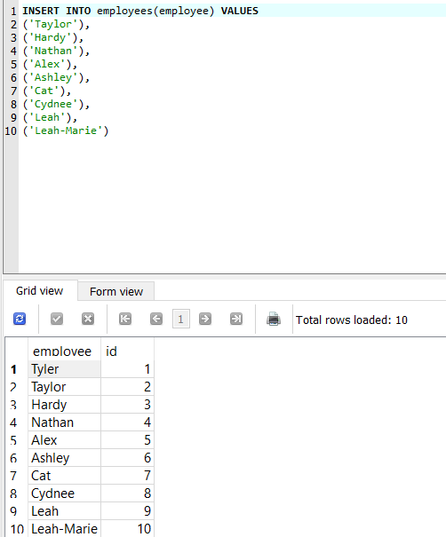
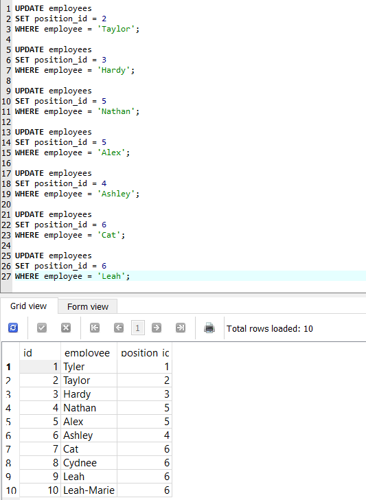
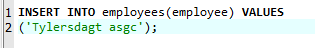
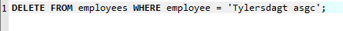
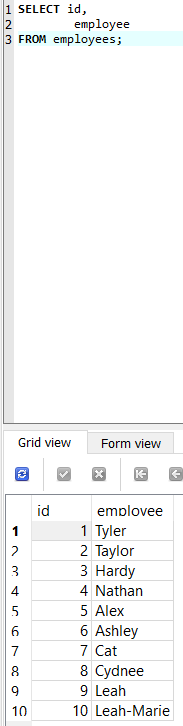
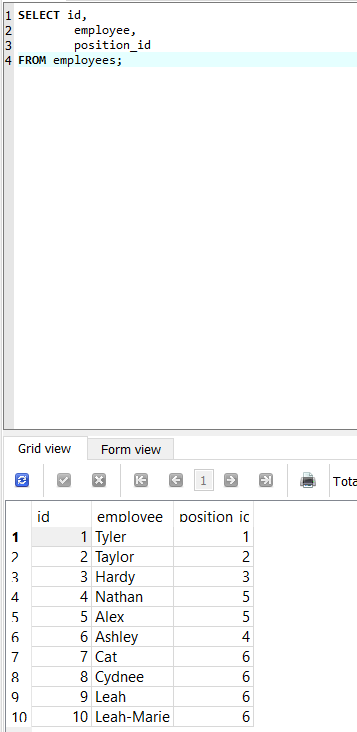
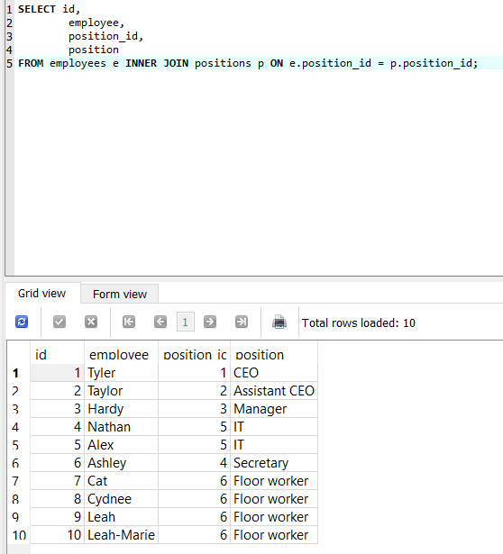

# Overview
My first SQL Database posted on Github. The database is a unspecified store and within this store I was able to:
* Insert new data into the table
* Modify existing data in the table
* Delete existing data from the table 
* Retrieve data from the table 

# Development Environment

* SQLite
* SQLite Studio GUI

# Execution

To open the database run this file in SQLite: `Store.db`

* Program screenshot showing the insert statement.

* Program screenshot showing the data being modified.

* Program screenshot showing the wrong data being put into the database showcasing step #1 of the delete query.

* Program screenshot showing the delete query being ran showcasing step #2 of the delete query.

* Program screenshot showing the result of the delete query being ran showcasing step #3 of the delete query.

* Program screenshot showing the Select statement.

* Program screenshot showing a two table join between the employees table and the positions table.

# Useful Websites

* [SQLite refrence] (.html)
